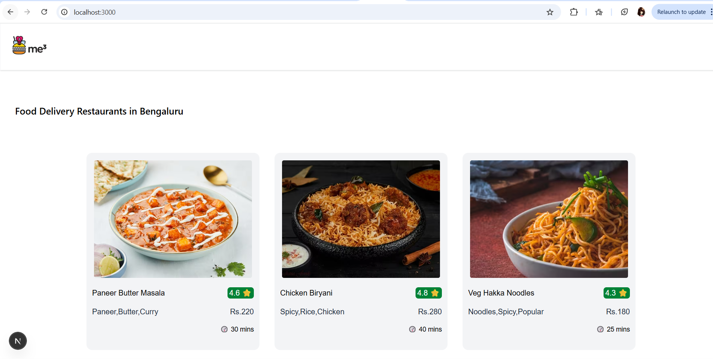
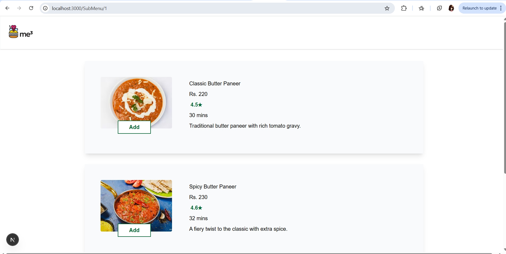

1. Project Overview:
   A demo application to explore Next.js App Router with dynamic routes and API endpoints.

2. Tech Stack
   Next.js (App Router) – for routing and API endpoints

TypeScript – for type safety

Tailwind CSS – for styling

3. Features
   API Routes:

/api/menu → fetch list of food items

/api/submenu/[id] → fetch submenu for a selected food item

Dynamic Routing

app/submenu/[id]/page.tsx → renders submenu details

Common Components

Header – navigation

FoodList – displays all food items

FoodCard – reusable card UI

ItemDetails – detail view for selected food item

4. Getting Started
   Clone the repo

Install dependencies:

npm install

Run dev server:
npm run dev

Open http://localhost:3000

Screenshots of the UI:

